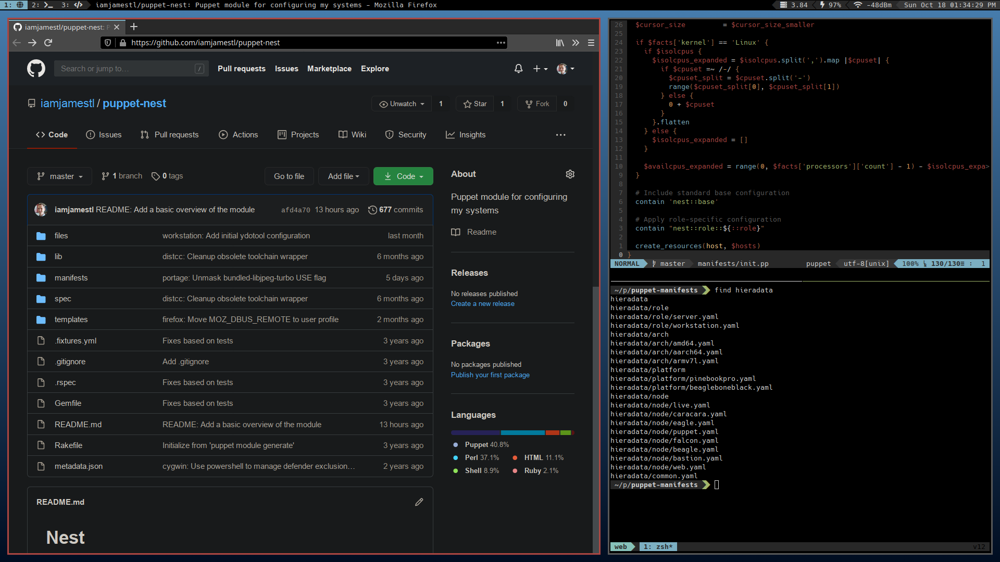

# Nest

Nest is the informal name I give to my Linux distribution based on Gentoo.  You
can learn more about it at [james.tl](https://james.tl/projects/nest/).

This Puppet module defines most of the behavior for the distribution, with
supporting code and Hiera data found in [a separate
project](https://github.com/iamjamestl/puppet-manifests).  As a
personal operating system, this module is subject to change frequently and it
is not worth documenting in detail; but if you are interested in browsing the
code, it may help you to know about the structure.

Where many integration-level Puppet modules implement a kind of roles and
profiles pattern which works well for small enterprises, this module implements
my own roles and platforms pattern which maps onto the needs of an individual
computer user in a more expressive way.  For example, the current environment
understands the following roles and platforms:

| Platform        | Role        |
|-----------------|-------------|
| generic         | server      |
| beagleboneblack | workstation |
| pinebookpro     |             |

So you can build a "generic workstation" or a "beagleboneblack server" or any
other combination.  Other types of platforms could include Raspberry Pi or EC2.
Other types of roles could include "router" or "media PC."

These roles and platforms sit on top of a more generic understanding of
architecture such that configurations can be defined separately for ARM and
different ARM platforms.

Beyond that, this module contains classes for a small set of services that can
be applied to virtually any combination of role and platform.

Unlike the [Puppet modules](https://james.tl/projects/puppet/) I work on
professionally, this one does not have a test suite.  Alas, time is limited and
this one's just for fun.
